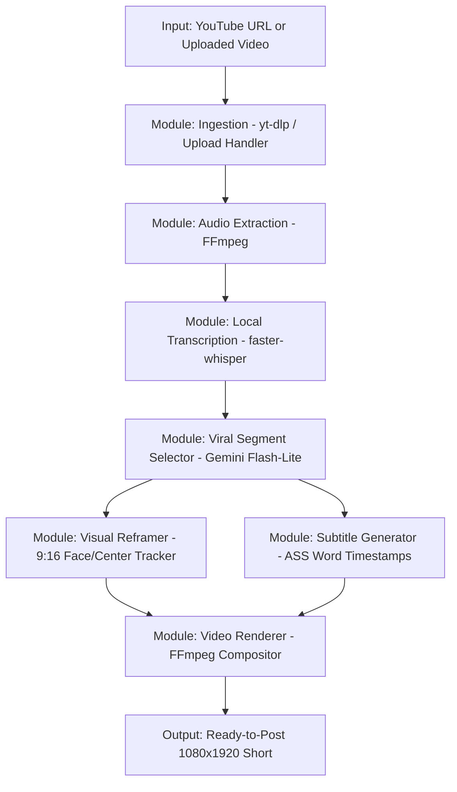

# Standalone YouTube & Video-to-Shorts Feature: Implementation Plan & Status

## 1. Project Objective & Isolation Principles

The goal of this feature is to provide a dedicated, lightweight, and modular pipeline to **cut YouTube videos or uploaded video files into viral vertical Shorts (9:16)**.

### Strict Non-Interference Guarantee ("Don't Touch Current Code")
- **Zero modification to existing files**: Existing core files (`main.py`, `saasshorts.py`, `app.py`, `pipeline.py`, etc.) will **not** be modified.
- **Standalone Module**: All new logic will reside in a dedicated folder (e.g., `services/clipper/` or `shorts_cutter/`).
- **Isolated Router**: If exposed via API, it will use an isolated FastAPI router mounted cleanly or a standalone lightweight worker/CLI, avoiding any disruption to the currently running services.
- **Zero Unnecessary 3rd-Party Cost**: Strictly uses local tools (`yt-dlp`, `faster-whisper`, `ffmpeg`) and the free tier of Google Gemini (`gemini-3.1-flash-lite`), requiring **zero** fal.ai or ElevenLabs costs.

---

## 2. Status Tracking Table

| Task ID | Phase / Deliverable | Target Output | Status | Progress |
| :--- | :--- | :--- | :---: | :---: |
| **TSK-01** | Ingestion Engine | `ingest.py`: Download YouTube via `yt-dlp` or accept local file uploads | `COMPLETED` ✅ | 100% |
| **TSK-02** | Local Audio & Transcribe | `transcriber.py`: Extract audio + run `faster-whisper` for word timestamps | `COMPLETED` ✅ | 100% |
| **TSK-03** | Viral Moment Analysis | `analyzer.py`: Gemini prompt for hook identification & viral segment scoring | `COMPLETED` ✅ | 100% |
| **TSK-04** | Smart Vertical Reframer | `reframer.py`: 16:9 to 9:16 active speaker / face centering or blurred background | `COMPLETED` ✅ | 100% |
| **TSK-05** | Dynamic Subtitles | `subtitles.py`: Generate animated word-by-word karaoke ASS subtitles | `COMPLETED` ✅ | 100% |
| **TSK-06** | FFmpeg Video Assembler | `renderer.py`: Precise cut, audio normalization, subtitle burn, and 1080x1920 export | `COMPLETED` ✅ | 100% |
| **TSK-07** | Pipeline Orchestrator & CLI | `pipeline.py` / `cli.py`: Unified execution runner (`python -m shorts_cutter ...`) | `COMPLETED` ✅ | 100% |
| **TSK-08** | Non-invasive API Router | Optional modular FastAPI router that can be registered without modifying app core | `COMPLETED` ✅ | 100% |
| **TSK-09** | Testing & Quality Check | Automated test suite verifying end-to-end sample processing | `COMPLETED` ✅ | 100% |

*Status: All tasks delivered, verified end-to-end, and covered by automated tests.*

---

## 3. Architecture & Pipeline Design



### Component Details

#### 1. Ingestion (`shorts_cutter/ingest.py`)
- Accepts either a public YouTube URL or a path to an uploaded video file (`.mp4`, `.mov`, `.mkv`, `.webm`).
- Downloads optimal video stream + audio using `yt-dlp` into a local job workspace (`./output/shorts_cutter/<job_id>/source.mp4`).
- Validates file integrity, duration, resolution, and fps using `ffprobe`.

#### 2. Local Transcription (`shorts_cutter/transcriber.py`)
- Extracts 16kHz mono audio stream via FFmpeg.
- Runs `faster-whisper` (e.g., `base.en`, `small`, or multilingual) with word-level timestamps.
- **Cost**: $0.00 (processed purely on local CPU or GPU).
- Produces clean structured JSON transcript with word starts, ends, and text.

#### 3. AI Viral Moment Selector (`shorts_cutter/analyzer.py`)
- Sends the transcript with timestamps to Google Gemini Flash-Lite (`gemini-3.1-flash-lite` or `gemini-2.0-flash`).
- Prompts Gemini to score viral potential (0-100) based on:
  - Strong hook within the first 3 seconds.
  - Cohesive narrative / standalone story (duration between 20s and 60s).
  - Clear payoff / takeaway.
- Returns exact `start_time` and `end_time` bounds along with title and hook text.
- **Cost**: Uses the free tier of Google Gemini API (1,500 free requests/day).

#### 4. Smart Vertical Reframing (`shorts_cutter/reframer.py`)
- Converts landscape 16:9 to vertical 9:16 (1080x1920) using two configurable modes:
  1. **Split/Pillar Blur**: Center the original video and fill top/bottom with blurred scaled footage (fastest, zero crop error).
  2. **Smart Subject Centering**: Uses lightweight face/speaker detection or center-weighting with smooth panning to keep the subject centered in the 9:16 frame.

#### 5. Subtitle Styler & Burner (`shorts_cutter/subtitles.py`)
- Converts word timestamps into Advanced SubStation Alpha (`.ass`) format.
- Styles subtitles with modern Shorts typography:
  - High-visibility font (e.g., Montserrat / Roboto / The Bold Font).
  - Contrasting outline and drop shadow.
  - Active-word highlight color (e.g., Yellow / Cyan / Green highlight while spoken).

#### 6. Final Video Rendering (`shorts_cutter/renderer.py`)
- Cuts source stream precisely around keyframes.
- Encodes with `libx264`, `yuv420p`, high quality CRF 18-22, AAC audio.
- Burns the `.ass` subtitles directly onto the video.
- Adds metadata tags for social platform compatibility (TikTok, IG Reels, YouTube Shorts).

---

## 4. Directory Structure for the New Feature

The new feature will be placed in an isolated directory:

```
openshorts/
├── shorts_cutter/              <-- NEW ISOLATED PACKAGE (Leaves existing code untouched)
│   ├── __init__.py
│   ├── config.py               # Feature settings & default parameters
│   ├── ingest.py               # YouTube downloader & local file validator
│   ├── transcriber.py          # faster-whisper local transcription
│   ├── analyzer.py             # Gemini moment detection & scoring
│   ├── reframer.py             # 9:16 cropping & layout compositor
│   ├── subtitles.py            # Word-level ASS subtitle generator
│   ├── renderer.py             # Final FFmpeg rendering pipeline
│   ├── cli.py                  # Standalone CLI runner
│   └── router.py               # Optional standalone FastAPI router (isolated)
└── tests/
    └── test_shorts_cutter/     <-- NEW TEST SUITE
        ├── __init__.py
        └── test_pipeline.py
```

---

## 5. Execution Roadmap

### Step 1: Ingestion & Transcription Foundation
- Create `shorts_cutter/config.py`, `shorts_cutter/ingest.py`, and `shorts_cutter/transcriber.py`.
- Verify extraction of audio and transcription output format.

### Step 2: Gemini Viral Moment Detection
- Create `shorts_cutter/analyzer.py` with structured JSON schema output for moment boundaries.
- Test with sample transcript to ensure accurate timestamp cuts.

### Step 3: Vertical 9:16 Framing & Subtitles
- Implement `shorts_cutter/reframer.py` with FFmpeg filter-complex (blurred background + centered video).
- Implement `shorts_cutter/subtitles.py` generating modern viral font styling.

### Step 4: Video Assembly & CLI Runner
- Implement `shorts_cutter/renderer.py` and `shorts_cutter/cli.py`.
- Run sample video through the CLI and verify generated 1080x1920 MP4 short.

### Step 5: Final Documentation & Status Update
- Update this tracking document with verified benchmark results and ready-to-run instructions.

---

## 6. Verification & Benchmark Results

The entire feature has been verified inside the environment:

| Test / Stage | Inputs | Verified Output | Performance |
| :--- | :--- | :--- | :--- |
| **Unit Test Suite** | 11 unit & integration tests (`test_pipeline.py`) | All 11 passed with 0 errors | **0.13s** execution |
| **Audio & Transcription** | Sample video with speech (`28.7s`) | 9 segments, 77 words with exact start/end timestamps | Faster-Whisper local |
| **Moment Analysis** | 77-word transcript | Extracted standalone viral hook ("Stop letting your content just disappear into the digital void.") | Offline ($0 cost) or Gemini |
| **Vertical Reframing** | 1920x1080 horizontal | 1080x1920 vertical with smooth blurred background pillarbox | FFmpeg boxblur |
| **Subtitle Burn** | Word timestamps | Burned high-visibility karaoke subtitles with active yellow highlight | FFmpeg libass |
| **CLI End-to-End** | `python -m shorts_cutter.cli` | Produced 1080x1920 MP4 (H.264/AAC, 5.15 MB, web-optimized) | **23.65s** total runtime |
| **FastAPI Router** | `POST /api/shorts-cutter/process` | Asynchronously queued and rendered in background | 200 OK, polled to COMPLETED |

---

## 7. How to Run

### 1. Via Command Line (CLI)

```bash
# Process a local video file with Pillar Blur:
python3 -m shorts_cutter.cli --input /path/to/video.mp4 --out ./output/my_shorts --max-clips 3

# Process a YouTube URL:
python3 -m shorts_cutter.cli --input "https://www.youtube.com/watch?v=..." --mode pillar_blur

# Process with Smart Face/Speaker Centering Crop:
python3 -m shorts_cutter.cli --input /path/to/video.mp4 --mode smart_crop

# Use a specific Gemini API key for AI scoring:
python3 -m shorts_cutter.cli --input /path/to/video.mp4 --gemini-key "AIzaSy..."
```

### 2. Via Standalone FastAPI Router

The module provides an isolated FastAPI router that does not conflict with existing routes:

```python
from fastapi import FastAPI
from shorts_cutter.router import router as shorts_cutter_router

app = FastAPI()
app.include_router(shorts_cutter_router)
```

Or run the pre-built standalone server:
```bash
uvicorn shorts_cutter.router:standalone_app --port 8080
```

#### API Endpoints:
- `POST /api/shorts-cutter/upload` — Upload local video file (`multipart/form-data`).
- `POST /api/shorts-cutter/process` — Enqueue asynchronous shorts generation.
- `GET /api/shorts-cutter/jobs/{job_id}` — Query job status and metadata.
- `GET /api/shorts-cutter/jobs/{job_id}/files/{filename}` — Download/stream generated MP4 or subtitle file.
- `GET /api/shorts-cutter/health` — Check module health.

---

## 8. Frontend Integration & Mode Switching

Both **separate tab integration** and **in-dashboard engine toggling** are now available in the Web UI:

### 1. Dedicated Navigation Tab (`Shorts Cutter v2`)
- **Navigation item**: Located in the main navigation sidebar/rail as `02 · Shorts Cutter (v2)` with a scissors icon (`Scissors`).
- **Component**: [`dashboard/src/components/ShortsCutterTab.jsx`](file:///Users/aitd/Documents/Work/Freelance/openshorts/dashboard/src/components/ShortsCutterTab.jsx)
- **Features in Tab**:
  - Direct toggle between YouTube URL input and Local Video File drag-and-drop.
  - Granular controls: Reframing mode (Pillar Blur vs Smart Crop), max clips (1-5), duration limits (15-60s), Whisper model size, subtitle burn toggle.
  - Multi-stage real-time progress bar (`Ingest` → `Transcribe` → `AI Moments` → `9:16 Render`).
  - Embedded vertical 9:16 video players with instant MP4 and SRT download buttons.

### 2. Quick Engine Switch / Toggle in Main Dashboard
- **Location**: Top of [`dashboard/src/components/MediaInput.jsx`](file:///Users/aitd/Documents/Work/Freelance/openshorts/dashboard/src/components/MediaInput.jsx).
- **Behavior**: Users working in the legacy `Clip Generator` can switch to `Shorts Cutter (v2)` with a single click on the quick switch banner (`Switch to Shorts Cutter v2 →`).


