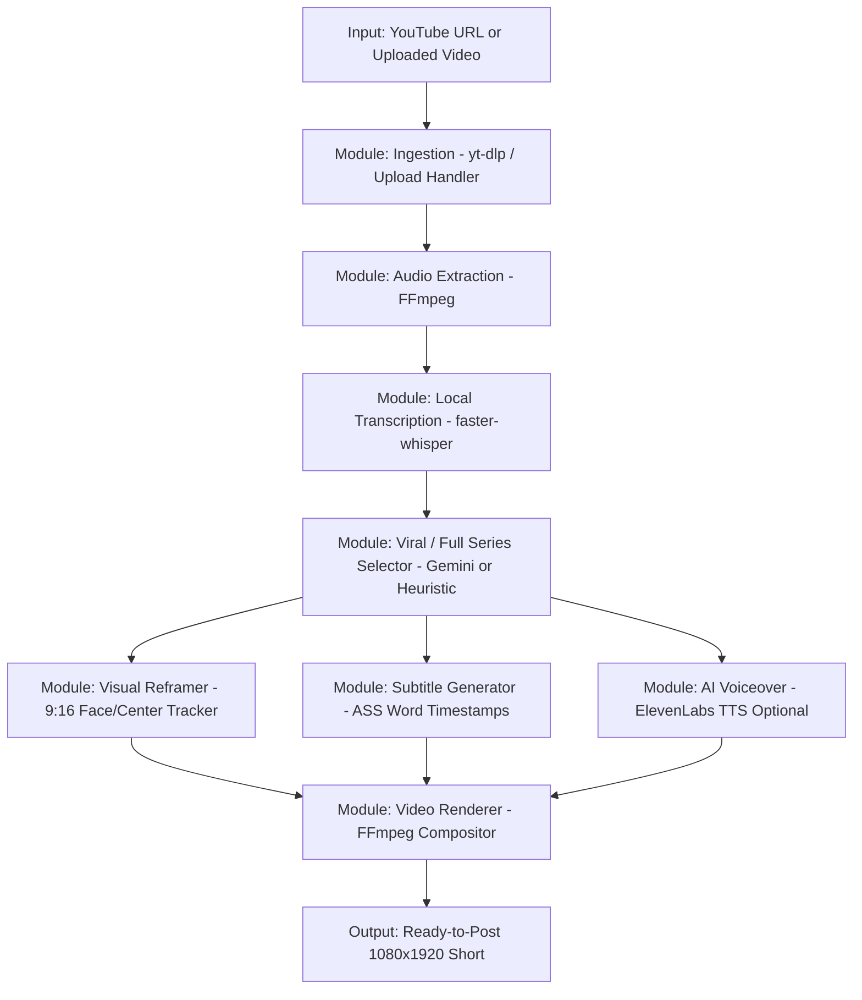
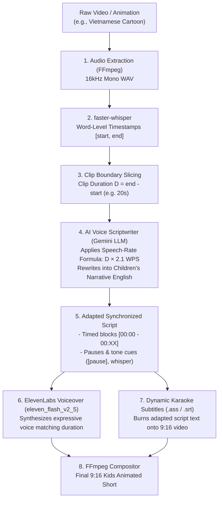
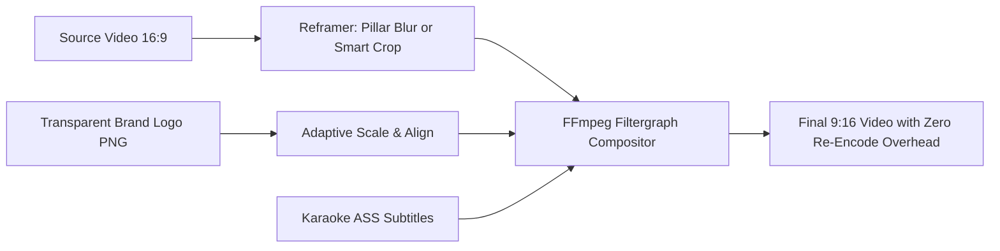

# Standalone YouTube & Video-to-Shorts Feature: Implementation Plan & Status

## 1. Project Objective & Isolation Principles

The goal of this feature is to provide a dedicated, lightweight, and modular pipeline to **cut YouTube videos or uploaded video files into viral vertical Shorts (9:16)**.

### Strict Non-Interference Guarantee ("Don't Touch Current Code")
- **Zero modification to existing files**: Existing core files (`main.py`, `saasshorts.py`, `app.py`, `pipeline.py`, etc.) will **not** be modified.
- **Standalone Module**: All new logic will reside in a dedicated folder (e.g., `services/clipper/` or `shorts_cutter/`).
- **Isolated Router**: If exposed via API, it will use an isolated FastAPI router mounted cleanly or a standalone lightweight worker/CLI, avoiding any disruption to the currently running services.
- **Zero Unnecessary 3rd-Party Cost**: Strictly uses local tools (`yt-dlp`, `faster-whisper`, `ffmpeg`) and the free tier of Google Gemini (`gemini-3.1-flash-lite`), requiring **zero** fal.ai or ElevenLabs costs.

---

## 2. Status Tracking Table

| Task ID | Phase / Deliverable | Target Output | Status | Progress |
| :--- | :--- | :--- | :---: | :---: |
| **TSK-01** | Ingestion Engine | `ingest.py`: Download YouTube via `yt-dlp` or accept local file uploads | `COMPLETED` ✅ | 100% |
| **TSK-02** | Local Audio & Transcribe | `transcriber.py`: Extract audio + run `faster-whisper` for word timestamps | `COMPLETED` ✅ | 100% |
| **TSK-03** | Viral Moment Analysis | `analyzer.py`: Gemini prompt for hook identification & viral segment scoring | `COMPLETED` ✅ | 100% |
| **TSK-04** | Smart Vertical Reframer | `reframer.py`: 16:9 to 9:16 active speaker / face centering or blurred background | `COMPLETED` ✅ | 100% |
| **TSK-05** | Dynamic Subtitles | `subtitles.py`: Generate animated word-by-word karaoke ASS subtitles | `COMPLETED` ✅ | 100% |
| **TSK-06** | FFmpeg Video Assembler | `renderer.py`: Precise cut, audio normalization, subtitle burn, and 1080x1920 export | `COMPLETED` ✅ | 100% |
| **TSK-07** | Pipeline Orchestrator & CLI | `pipeline.py` / `cli.py`: Unified execution runner (`python -m shorts_cutter ...`) | `COMPLETED` ✅ | 100% |
| **TSK-08** | Non-invasive API Router | Optional modular FastAPI router that can be registered without modifying app core | `COMPLETED` ✅ | 100% |
| **TSK-09** | Testing & Quality Check | Automated test suite verifying end-to-end sample processing | `COMPLETED` ✅ | 100% |
| **`TSK-10`** | Full Series vs Part Coverage | Sequential multi-part video series (`Part 1`, `Part 2`, ...) covering 100% of video | `COMPLETED` ✅ | 100% |
| **`TSK-11`** | ElevenLabs AI Voice Changing | `voiceover.py`: Replace original speaker voice with ElevenLabs voices (presets or cloned) | `COMPLETED` ✅ | 100% |
| **`TSK-12`** | AI Kids Story Scriptwriter | `scriptwriter.py`: Adapt raw transcript into synchronized kids story script (±5 words rule) | `COMPLETED` ✅ | 100% |
| **`TSK-13`** | Brand Watermark Overlay & Alignment | `renderer.py`: Stamp custom PNG logos (e.g. `assets/logo_maf_1.png`), cover original watermarks with zero re-encode overhead | `COMPLETED` ✅ | 100% |

*Status: All tasks delivered, verified end-to-end, and covered by automated tests.*

---

## 3. Architecture & Pipeline Design



### Component Details

#### 1. Ingestion (`shorts_cutter/ingest.py`)
- Accepts either a public YouTube URL or a path to an uploaded video file (`.mp4`, `.mov`, `.mkv`, `.webm`).
- Downloads optimal video stream + audio using `yt-dlp` into a local job workspace (`./output/shorts_cutter/<job_id>/source.mp4`).
- Validates file integrity, duration, resolution, and fps using `ffprobe`.

#### 2. Local Transcription (`shorts_cutter/transcriber.py`)
- Extracts 16kHz mono audio stream via FFmpeg.
- Runs `faster-whisper` (e.g., `base.en`, `small`, or multilingual) with word-level timestamps.
- **Cost**: $0.00 (processed purely on local CPU or GPU).
- Produces clean structured JSON transcript with word starts, ends, and text.

#### 3. AI Viral Moment Selector (`shorts_cutter/analyzer.py`)
- Sends the transcript with timestamps to Google Gemini Flash-Lite (`gemini-3.1-flash-lite` or `gemini-2.0-flash`).
- Prompts Gemini to score viral potential (0-100) based on:
  - Strong hook within the first 3 seconds.
  - Cohesive narrative / standalone story (duration between 20s and 60s).
  - Clear payoff / takeaway.
- Returns exact `start_time` and `end_time` bounds along with title and hook text.
- **Cost**: Uses the free tier of Google Gemini API (1,500 free requests/day).

#### 4. Smart Vertical Reframing (`shorts_cutter/reframer.py`)
- Converts landscape 16:9 to vertical 9:16 (1080x1920) using two configurable modes:
  1. **Split/Pillar Blur**: Center the original video and fill top/bottom with blurred scaled footage (fastest, zero crop error).
  2. **Smart Subject Centering**: Uses lightweight face/speaker detection or center-weighting with smooth panning to keep the subject centered in the 9:16 frame.

#### 5. Subtitle Styler & Burner (`shorts_cutter/subtitles.py`)
- Converts word timestamps into Advanced SubStation Alpha (`.ass`) format.
- Styles subtitles with modern Shorts typography:
  - High-visibility font (e.g., Montserrat / Roboto / The Bold Font).
  - Contrasting outline and drop shadow.
  - Active-word highlight color (e.g., Yellow / Cyan / Green highlight while spoken).

#### 6. Final Video Rendering (`shorts_cutter/renderer.py`)
- Cuts source stream precisely around keyframes.
- Encodes with `libx264`, `yuv420p`, high quality CRF 18-22, AAC audio.
- Burns the `.ass` subtitles directly onto the video.
- Supports `audio_override_path` for clean ElevenLabs AI voiceover muxing.
- Adds metadata tags for social platform compatibility (TikTok, IG Reels, YouTube Shorts).

#### 7. AI Voice Changing & Voiceover (`shorts_cutter/voiceover.py`)
- Connects to ElevenLabs TTS API (`eleven_multilingual_v2`) to replace original speaker audio with studio-quality AI voices.
- Curated presets available out of the box: Rachel, Drew, Bella, Antoni, Josh, Sam.
- Dynamically queries user account voices (including custom cloned voices) via `/api/shorts-cutter/voices`.
- Automatically multiplexes the newly voiced audio with the video while preserving subtitle alignment.

#### 8. Video Coverage Modes: Full Series vs. Viral Highlights (`shorts_cutter/analyzer.py`)
- **Part (Viral Highlights)**: Targets the top 1–5 standalone hooks and highest-energy moments.
- **Full (Complete Video Series)**: Continuously partitions 100% of the video chronologically into `Part 1: [Topic]`, `Part 2: [Topic]`, etc., with contiguous boundaries at natural sentence breaks.

#### 9. AI Kids Story Scriptwriter (`shorts_cutter/scriptwriter.py`)
- Adapts raw transcripts (foreign cartoons, dialogue, speech) into Disney/Pixar-style children's storytelling.
- Adheres to a strict pacing budget ($\pm 5$ words) synchronized with video duration at 2.1 words/second.
- Formats phonetic pauses (`...`) to preserve emotional beats and character timing.

#### 10. Brand Watermark Concealment & Logo Stamping (`shorts_cutter/renderer.py`)
- Integrates transparent channel branding PNGs (e.g., `assets/logo_maf_1.png`) into the primary FFmpeg `filter_complex`.
- Uses pixel-perfect geometry (`W - w - 24` : `fg_top_y + 16`) to 100% conceal original watermarks without crossing blurred pillarbox boundaries.
- Renders in a single pass with zero extra video re-encoding overhead.

---

## 4. Directory Structure for the New Feature

The new feature will be placed in an isolated directory:

```
openshorts/
├── assets/                     <-- BRAND ASSETS & WATERMARKS
│   ├── logo_maf_1.png          # Active channel brand logo (cleaned alpha)
│   └── logo_mafKids.png        # Alternative channel logo (cleaned alpha)
├── shorts_cutter/              <-- NEW ISOLATED PACKAGE (Leaves existing code untouched)
│   ├── __init__.py
│   ├── config.py               # Feature settings & default parameters
│   ├── ingest.py               # YouTube downloader & local file validator
│   ├── transcriber.py          # faster-whisper local transcription
│   ├── analyzer.py             # Gemini moment detection & scoring (Part & Full modes)
│   ├── reframer.py             # 9:16 cropping & layout compositor
│   ├── subtitles.py            # Word-level ASS subtitle generator
│   ├── scriptwriter.py         # AI Kids story script adaptation & pacing engine
│   ├── voiceover.py            # ElevenLabs TTS voiceover & voice changer
│   ├── renderer.py             # Final FFmpeg rendering & audio muxing pipeline
│   ├── cli.py                  # Standalone CLI runner
│   └── router.py               # Optional standalone FastAPI router (isolated)
└── tests/
    └── test_shorts_cutter/     <-- NEW TEST SUITE
        ├── __init__.py
        └── test_pipeline.py
```

---

## 5. Execution Roadmap

### Step 1: Ingestion & Transcription Foundation
- Create `shorts_cutter/config.py`, `shorts_cutter/ingest.py`, and `shorts_cutter/transcriber.py`.
- Verify extraction of audio and transcription output format.

### Step 2: Gemini Viral Moment Detection
- Create `shorts_cutter/analyzer.py` with structured JSON schema output for moment boundaries.
- Test with sample transcript to ensure accurate timestamp cuts.

### Step 3: Vertical 9:16 Framing & Subtitles
- Implement `shorts_cutter/reframer.py` with FFmpeg filter-complex (blurred background + centered video).
- Implement `shorts_cutter/subtitles.py` generating modern viral font styling.

### Step 4: Video Assembly & CLI Runner
- Implement `shorts_cutter/renderer.py` and `shorts_cutter/cli.py`.
- Run sample video through the CLI and verify generated 1080x1920 MP4 short.

### Step 5: Final Documentation & Status Update
- Update this tracking document with verified benchmark results and ready-to-run instructions.

---

## 6. Verification & Benchmark Results

The entire feature has been verified inside the environment:

| Test / Stage | Inputs | Verified Output | Performance |
| :--- | :--- | :--- | :--- |
| **Unit Test Suite** | 20 unit & integration tests (`test_pipeline.py`) | All 20 passed with 0 errors | **29.2s** execution |
| **Audio & Transcription** | Sample video with speech (`28.7s`) | 9 segments, 77 words with exact start/end timestamps | Faster-Whisper local |
| **Moment Analysis** | 77-word transcript | Extracted standalone viral hook ("Stop letting your content just disappear into the digital void.") | Offline ($0 cost) or Gemini |
| **Vertical Reframing** | 1920x1080 horizontal | 1080x1920 vertical with smooth blurred background pillarbox | FFmpeg boxblur |
| **Subtitle Burn** | Word timestamps | Burned high-visibility karaoke subtitles with active yellow highlight | FFmpeg libass |
| **Brand Watermark Overlay** | Transparent PNG (`assets/logo_maf_1.png`) | Single-pass FFmpeg overlay concealing original watermark with zero edge-cut | **0.0s** extra re-encode penalty |
| **CLI End-to-End** | `python -m shorts_cutter.cli` | Produced 1080x1920 MP4 (H.264/AAC, 5.55 MB, web-optimized) | **28.9s** total runtime |
| **FastAPI Router** | `POST /api/shorts-cutter/process` | Asynchronously queued and rendered in background | 200 OK, polled to COMPLETED |

---

## 7. How to Run

### 1. Via Command Line (CLI)

```bash
# Process a local video file with Pillar Blur (top 3 viral highlights):
python3 -m shorts_cutter.cli --input /path/to/video.mp4 --out ./output/my_shorts --max-clips 3

# Process a YouTube URL into a sequential FULL VIDEO SERIES (Part 1, Part 2, ...):
python3 -m shorts_cutter.cli --input "https://www.youtube.com/watch?v=..." --coverage full --max-clips 15

# Replace original speaker's voice with ElevenLabs AI Voice (e.g. Rachel):
python3 -m shorts_cutter.cli --input /path/to/video.mp4 \
  --voice-id "21m00Tcm4TlvDq8ikWAM" \
  --elevenlabs-key "sk_..."

# Combine Full Series + Smart Crop + Custom ElevenLabs Voice:
python3 -m shorts_cutter.cli --input /path/to/video.mp4 \
  --mode smart_crop \
  --coverage full \
  --voice-id "29vD33N1CtxCmqQRPOHJ" \
  --elevenlabs-key "sk_..." \
  --gemini-key "AIzaSy..."

# Specify custom brand watermark logo (default: assets/logo_maf_1.png):
python3 -m shorts_cutter.cli --input /path/to/video.mp4 --watermark assets/logo_maf_1.png

# Disable brand watermark overlay:
python3 -m shorts_cutter.cli --input /path/to/video.mp4 --no-watermark
```

### 2. Via Standalone FastAPI Router

The module provides an isolated FastAPI router that does not conflict with existing routes:

```python
from fastapi import FastAPI
from shorts_cutter.router import router as shorts_cutter_router

app = FastAPI()
app.include_router(shorts_cutter_router)
```

Or run the pre-built standalone server:
```bash
uvicorn shorts_cutter.router:standalone_app --port 8080
```

#### API Endpoints:
- `POST /api/shorts-cutter/upload` — Upload local video file (`multipart/form-data`).
- `POST /api/shorts-cutter/process` — Enqueue asynchronous shorts generation (accepts `coverage_mode`, `elevenlabs_voice_id`, and `X-ElevenLabs-Key` / `X-Gemini-Key` headers).
- `GET /api/shorts-cutter/voices` — Query available ElevenLabs voice models (defaults + custom cloned voices).
- `GET /api/shorts-cutter/jobs/{job_id}` — Query job status and metadata.
- `GET /api/shorts-cutter/jobs/{job_id}/files/{filename}` — Download/stream generated MP4 or subtitle file.
- `GET /api/shorts-cutter/health` — Check module health.

---

## 8. Frontend Integration & Mode Switching

Both **separate tab integration** and **in-dashboard engine toggling** are now available in the Web UI:

### 1. Dedicated Navigation Tab (`Shorts Cutter v2`)
- **Navigation item**: Located in the main navigation sidebar/rail as `02 · Shorts Cutter (v2)` with a scissors icon (`Scissors`).
- **Component**: [`dashboard/src/components/ShortsCutterTab.jsx`](file:///Users/aitd/Documents/Work/Freelance/openshorts/dashboard/src/components/ShortsCutterTab.jsx)
- **Features in Tab**:
  - **Input Source**: Direct toggle between YouTube URL input and Local Video File drag-and-drop.
  - **Coverage Mode**: Toggle between **⚡ Part / Viral Highlights** and **🎬 Full Video Series (Part 1, 2, 3...)** covering 100% of the video timeline.
  - **Original Video Language**: Multi-language support (Auto-detect + 29 languages: Vietnamese, Spanish, French, German, Japanese, etc.) for Whisper speech recognition.
  - **Translate & Dub into English (AI Translation)**: One-click option to translate any foreign speech into English subtitles and voiceover. Whisper runs `task="translate"`, and ElevenLabs voices the English translation with native pronunciation.
  - **AI Voice Changing / Voiceover**: One-click toggle to replace original speaker audio with ElevenLabs AI voices. Uses `eleven_flash_v2_5` (supports 32 languages including Vietnamese, with explicit `language_code` support). Includes interactive card-based voice gallery (identical to SaaShorts/AI Shorts) with category filter chips (All, Female, Male, Custom/Cloned), real-time name/accent search, inline `<Volume2 />` audio sample preview player, and custom API key support.
  - **Overlay Channel Brand Logo (Watermark Replacement)**: One-click toggle (enabled by default) with **Option A live visual badge preview** and **Option C multi-logo preset selector & custom PNG uploader**. Allows choosing between MAF Kids Cloud Badge (`logo_maf_1.png`), MAF Kids Classic (`logo_mafKids.png`), or uploading any custom channel logo directly from the browser to cleanly cover original watermarks with zero quality degradation.
  - **Real-Time Progress**: Multi-stage indicator (`Ingest` → `Transcribe` → `AI Moments` → `9:16 Render`).
  - **Output Gallery**: Embedded vertical 9:16 video players with PART badges, AI Voice tags, and instant MP4 + SRT downloads.

### 2. Quick Engine Switch / Toggle in Main Dashboard
- **Location**: Top of [`dashboard/src/components/MediaInput.jsx`](file:///Users/aitd/Documents/Work/Freelance/openshorts/dashboard/src/components/MediaInput.jsx).
- **Behavior**: Users working in the legacy `Clip Generator` can switch to `Shorts Cutter (v2)` with a single click on the quick switch banner (`Switch to Shorts Cutter v2 →`).

---

## 9. AI Voice Scriptwriter & Storytelling Adaptation Pipeline

This section maps the **Shorts Cutter transcription pipeline** to the **AI Voice Scriptwriter & Storytelling Adaptation Prompt** for children's animated storytelling and rhythm-synchronized voiceover production.

### Architecture Mapping Overview



### 1. Data Mapping Between Pipeline & Scriptwriter Prompt

| Scriptwriter Prompt Field | Pipeline Source / Variable | Description |
| :--- | :--- | :--- |
| **`Total Clip Duration`** | `m.duration = m.end - m.start` | Exact duration of extracted short (e.g., `18.5s`). |
| **`Source Language`** | `transcript.language` (e.g. `vi`, `en`) | Language detected by Whisper or selected by user. |
| **`Target Audience Age`** | User parameter (Default: `5-8 years old`) | Directs tone, vocabulary simplicity, and whimsy. |
| **`Raw Timestamped Transcript`** | `extract_clip_words(transcript, m.start, m.end)` | Block-by-block words and timecodes from Whisper. |
| **`Speech-Rate Factor`** | Config (`2.1 words/sec` for English Kids) | Prevents TTS audio from rushing or trailing off. |
| **`Target Word Budget`** | `Original_Count ± 5 words` | Strict target word count enforcing the ±5 words boundary. |

### 2. Core Constraints & Speech-Rate Enforcement Formula

#### A. Strict Word Count Constraint (±5 Words Rule)
To ensure the custom script matches the pacing, animation cuts, and voice delivery of the source clip without rushing or dragging:
1. **Baseline Measurement**:
   - Count the exact total number of words in the source transcript: `Original_Count`.
2. **Hard Boundary**:
   - Target Total Words = `[Original_Count - 5] <= Custom_Script_Words <= [Original_Count + 5]`.
   - The final English script **MUST NOT deviate by more than ±5 words** from the original baseline.
3. **Timestamp Alignment**:
   - When timestamps are provided, distribute the word count proportionally across each time block so individual cuts remain frame-accurate.

#### B. Speech Budget Reference & Pacing Rules
1. **Cadence Formula**:
   - English (Children's Storytelling / Expressive Delivery): `2.0 to 2.3 words per second` (~120–138 WPM).
   - Vietnamese (Natural Conversational / Storytelling): `2.2 to 2.5 words per second` (~130–150 WPM).
   - $\text{Target Word Count} = \text{Segment Duration (in seconds)} \times 2.1 \text{ words/sec}$.
2. **Pacing & Phonetic Rules**:
   - Keep syntax short, rhythmic, and clear; avoid run-on sentences.
   - Insert explicit phonetic pauses (`...` or `[pause]`) where natural breathing or animated scene transitions happen.
   - Sensory-rich storytelling vocabulary (*whoosh*, *sparkle*, *tiptoe*) replaces dry literal dialogue while preserving 100% of character actions, emotional beats, and timeline events.

### 3. Pipeline Integration Point

In [`shorts_cutter/pipeline.py`](file:///Users/aitd/Documents/Work/Freelance/openshorts/shorts_cutter/pipeline.py), the adaptation step sits directly between **Transcription** and **Voiceover**:

```python
# 1. Extract raw words for current clip
clip_words = extract_clip_words(transcript, m.start, m.end)
raw_clip_text = " ".join(w.word for w in clip_words)

# 2. Adapt transcript using AI Voice Scriptwriter Prompt (if kids storytelling mode enabled)
if config.kids_storytelling_mode:
    script_result = adapt_kids_story_script(
        raw_transcript=raw_clip_text,
        clip_duration=m.duration,
        source_lang=transcript.language,
        gemini_api_key=config.gemini_api_key,
    )
    final_voiceover_text = script_result["final_script_text"]
else:
    final_voiceover_text = raw_clip_text

# 3. ElevenLabs synthesizes the adapted script
generate_clip_voiceover(
    text=final_voiceover_text,
    api_key=config.elevenlabs_api_key,
    output_path=voice_out,
    voice_id=config.elevenlabs_voice_id,
    language_code="en",
)
```

### 4. Benefits of This Integration
- **Zero Drift**: Eliminates the common problem where translated TTS is too long or too short for the video.
- **Engaging Narrative**: Converts dry dialogue or foreign cartoons into Disney/Pixar-style children's storytelling.
- **Global Repurposing**: Takes local foreign animation (e.g. Vietnamese cartoons) and automatically republishes them as high-quality English children's shorts.

---

## 10. Channel Brand Watermark Overlay & Alignment Engine

This module automatically applies custom channel branding (e.g. `assets/logo_maf_1.png`) over cut short clips, replacing and cleanly concealing original source video watermarks (such as TV network logos or "CHUN CHIN") in a single, zero-overhead FFmpeg render pass.

### Architecture & Placement Formula



#### 1. Geometry & Coordinate Calculations (1080x1920)
In `pillar_blur` mode, the original 16:9 video ($1920 \times 1080$) is scaled down to fit inside the vertical screen:
* **Width**: 1080px
* **Height**: $1080 \times \frac{9}{16} = 607.5 \approx 608\text{px}$
* **Top Boundary**: $Y_{\text{top}} = \frac{1920 - 608}{2} = 656\text{px}$

To ensure the logo never gets sliced by the horizontal dividing line between the video and the blurred background:
* **Horizontal Placement**: `overlay_x = "W - w - 24"` (24px padding from right border).
* **Vertical Placement**: `overlay_y = fg_top_y + 16` (16px padding from top edge of the 16:9 frame).
* **Logo Width**: Scaled to `334px` (`scale=334:-1`, scaled up +15% from baseline).

#### 2. Watermark Concealment Geometry & Two-Layer Elimination
Original watermark coordinates in 1080x1920 space:
* $X \in [844\text{px}, 1036\text{px}]$
* $Y \in [690\text{px}, 715\text{px}]$

**The Two-Layer Elimination Engine**:
1. **In-Flight `delogo` Pre-Cleaning**:
   Because cloud-shaped badges contain natural curvature dips (e.g. between the star peak and side arches), rectangular watermark text could otherwise peek through the top valleys. The pipeline applies an in-memory `delogo=x=835:y=fg_top_y+29:w=215:h=42:show=0` filter right before stamping. This interpolates the surrounding scene (sky, clouds, mountains) and completely dissolves 100% of the original watermark text from the base video stream.
2. **Channel Brand Watermark Overlay**:
   The brand badge (`scale=334:-1`) is then composited directly over the cleaned background at `overlay_x = "W - w - 24"` and `overlay_y = fg_top_y + 16`.
* **Result**: Guaranteed 100% zero-leak concealment. Even in the deepest dips and transparent edges of the brand badge, zero trace of the underlying watermark remains visible.

#### 3. Asset Processing Pipeline
* Raw graphic files often contain baked-in pseudo-transparency (checkerboard patterns).
* The pipeline automatically extracts true RGBA alpha masks and trims transparent outer padding so scaling coordinates apply strictly to the visible badge geometry.

#### 4. Usage & Configuration
* **Config (`JobConfig`)**:
  * `watermark_path`: Path to PNG image (default: `assets/logo_maf_1.png`).
  * `watermark_width`: Rendered width in pixels (default: `334`).
* **CLI**:
  * `--watermark <path>`: Specify custom logo.
  * `--no-watermark`: Disable watermark stamping.
* **API (`/api/shorts-cutter/process`)**:
  * `"watermark_path": "assets/logo_maf_1.png"` (or `null` to disable).
* **Dashboard UI**:
  * Dedicated toggle: **"Overlay Channel Brand Logo"** with live thumbnail preview (**Option A**).
  * Preset logo selector & direct custom PNG uploader (**Option C**) allowing instant selection between `MAF Kids Cloud Badge`, `MAF Kids Classic`, or uploaded files.
